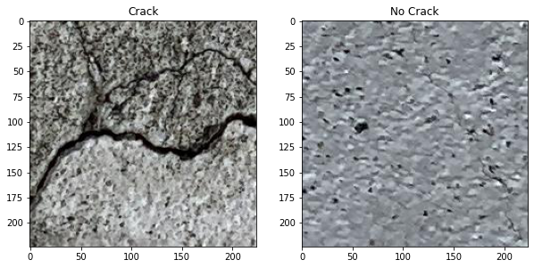
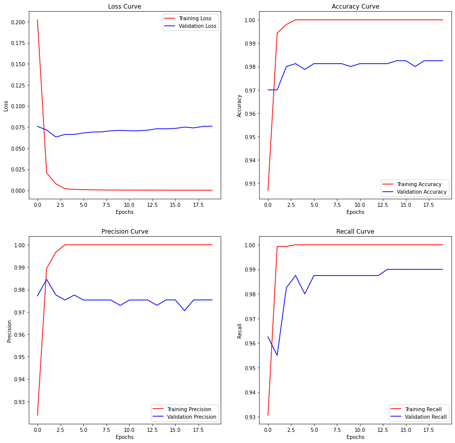

# L&T EduTech Hackathon
#### Problem Domain: AI Solutions for Industrial and Societal Problems
**PS1 -**

**Description -** Concrete cracking is a major issue in Bridge Engineering. Detection of cracks facilitates the design, construction and maintenance of bridges effectively.
**Requirement Specification:**

-   Use open source dataset (From the link:  [https://cutt.ly/PS_1_dataset](https://cutt.ly/PS_1_dataset))
-   Develop a suitable Deep Learning framework which can detect the crack in the image from the dataset
-   Transfer Learning based DL framework would be appreciated

**Judging Metrics:** Provide  Precision, Recall and F1 score as Judging metrics

### Dataset Visualization

### Model Architecture
VGG16(224,224,3) -> Dense(112, relu) -> Dense(52, relu) -> Output(1, sigmoid) 
### Training Graphs

### Metrics
|Dataset|Accuracy  |Precision  |Recall|F1 Score|
|--|--| --| --|--|
|Training (3000)  | 100% | 100% | 100% | 100%
|Validation (800)  | 98.25% | 97.54% | 99% | 98.11%
|Testing (200)  | 100% | 100% | 100% | 100%

### Prediction over higher resolution images

